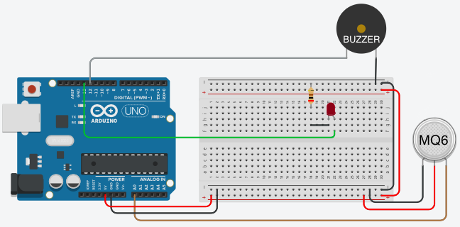

# Arduino MQ6

   This Project connects an Arduino Uno who collects LPG gas (cooking gas). If the gas is the air, the alarm (Buzzer) ring. The sensor MQ6 are able to collect Methane (CH4) gas too, so I show this information on Arduino serial port.
 

# The main idea of this project is:

    1 - Collect LPG and CH4 gas;
    
    2 - Ring alarm (BUZZER) with there is any LPG gas concentration in the air.
    

# Acknolagenmet:
   Thanks, Professor Diego Haddad from CEFET/RJ to make this project possible and the followings websites that I learn how to do this project.

bib:
----
    1 - Basic concepts:
        https://www.arduino.cc:
    
    2 - Build the project:
        https://www.tinkercad.com
 
    3 - Instructions to MQ Gas Sensors:
         https://playground.arduino.cc/Main/MQGasSensors

    4 - Demo for MQ-6 Gas Sensor Module, especially to calibrate the sensor:
         www.circuits4you.com

    And so many others.

#PS:
    Feel free to fork, comment, ask, criticism or suggest something to improve this project.
